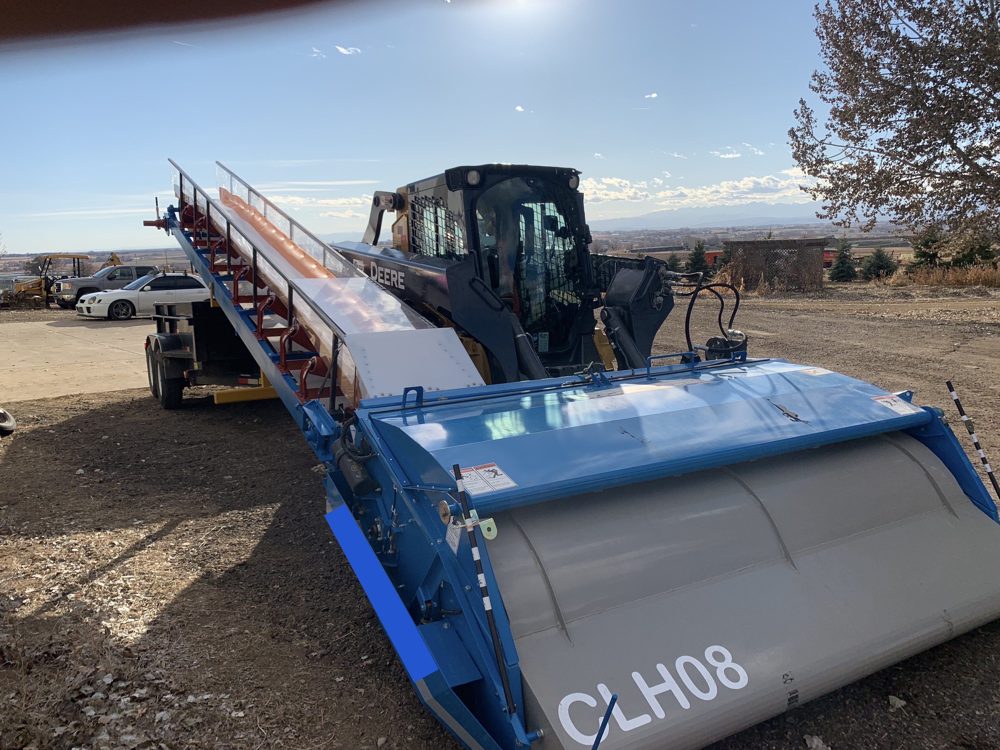

Brady Price is an experienced cannabis cultivator, currently owner of a successful fertilizer company called Grease from Fractal Growth. Developing organic nutrients with studying cyanobacteria, microbes, fungi, and trichomes. Previously,  was a head cultivation manager at a state-of-the-art indoor commercial grow facility in Colorado where he implemented all facility standard operating procedures, creating an increased production from 330 pounds to 1500 pounds.  Multiple records for THC of 30% or greater, such as, Banana OG at 31.59% and Chem 4 at 31.4%. Started a partnership with Sunrise Genetics conducting a selective breeding with multiple thc and cbd chemotype cultivars. We into hemp farming producing twenty thousand dried pounds on five acres with my organic regiments. Development one of a kind custom machinery including a harvester and plant de-stripper. Built, ran, owned a full extraction lab with 15 pound butane closed loop extractor, with full rotary evaporators and a 20L short path distiller with a flash chromatography. Partnered with Dinaminica Generale from Italy with a NIR nutrient scanner for hemp and cannabis, programed spectrometer levels with the AgriNIR machine. Nutrient ferments and new rhizophagy studies with cyanobacteria biology is my was of great understanding in nutrient, pest and disease control. Using bacillus and mycelium management with fine skill and timing. He has an excellent understanding of environmental control.

